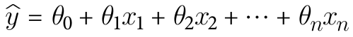

# Chapter 4

Created by: 성원 송
Created time: August 22, 2025 3:56 PM
Last edited by: 성원 송
Last updated time: August 22, 2025 3:56 PM

# 4. 선형 회귀 모델 훈련

### 선형 회귀

1. **선형 회귀 모델**

성능 측정 지표를 사용해 training set에 맞도록 모델 파라미터를 설정(+일반화 고려)

- 좋은 성능 지표 = 최종 비즈니스 목표에 근접한 것
- 최종 모델 평가에 사용되는 성능 지표와 다른 손실 함수를 최적화하는 경우 존재
    
    훈련 중에만 필요한 추가 항(정규화 등) 존재하는 경우
    
    해당 함수의 최적화가 더 쉬운 경우
    
    e.g. 로그 손실 비용 함수로 학습 / precision & recall 로 평가
    

선형 회귀 모델 비용 함수 예시: RMSE, MSE 등

1. **closed-form equation을 이용한 모델 파라미터 계산**

**a. 정규 방정식(normal equation)**

: 비용 함수를 최소화하는 theta 값을 찾는 해석적 방법

**b. 무어-펜로즈 pseudoinverse** 를 계산

https://angeloyeo.github.io/2020/11/11/pseudo_inverse.html

**특이값 분해**(SVD, singular value decomposition) 사용해 계산

https://angeloyeo.github.io/2019/08/01/SVD.html

https://darkpgmr.tistory.com/106

- 효율적 계산 가능
- 모든 행렬에 적용 가능(정규 방정식 작동하지 않는 경우 )

계산 복잡도

정규 방정식의 역행렬 계산: O(n^2.4)~O(n^3), (n: feature 수)

SVD: O(n^2), (n: feature 수)

정규 방정식, SVD: O(m), (m: training set의 샘플 수)

### 경사 하강법

(GD, gradient descent)

- 비용 함수 최소화하는 모델 파라미터를 찾는 최적화 알고리즘
- random theta 값으로 시작, 파라미터 벡터 theta에 대해 비용 함수의 현재 gradient 계산해 비용 함수 감소하는 방향으로 step 진행 반복, gradient=0 되어 비용 함수값 수렴하는 파라미터 탐색
- learning rate hyperparameter: step의 크기 결정
    - step 큰 경우: 발산 가능 / step 작은 경우: global minimum 도달 어려울 수 있음, 시간 소요 증가

**batch 경사 하강법**

모든 step마다 training set 전체 사용

각 파라미터에 대해 편미분

특성 수 많은 경우 정규 방정식, SVD 분해보다 빠름

eta: learning rate

epoch: training set에 대해 반복하는 각 step

최적 learning rate 탐색: grid search

반복 횟수 제한해 수렴 오래 걸리는 경우 제외 / gradient vector의 norm이 허용 오차(epsilon)보다 작아지면 알고리즘 중지 등

허용 오차 범위 내에서 최적값 도달 시 O(1/epsilon)의 반복 필요

**확률적 경사 하강법(SGD)**

매 step에서 랜덤으로 선택한 하나의 샘플의 gradient 계산해 step 진행

- 빠르지만 불안정
- local minimum 건너뛰어 global minimum 찾을 가능성 높음
- learning rate 점진적 감소 ⇒ 최소값에 도달 가능하도록 함
    
    learning schedule: 매 반복에서 학습률을 결정하는 함수
    

훈련 샘플이 독립 동일 분포를 만족해야, 평균적으로 파라미터가 global minimum을 향해 진행 보장 가능

사용하는 훈련 샘플 정렬하는 경우 일반적으로 성능 향상 X

**mini-batch 경사 하강법**

각 step에서 임의의 작은 샘플 set에 대해 gradient 계산 진행

SGD 대비 안정, 최소값에 더 가까이 도달 / local minimum 탈출 어려움

모든 종류의 경사 하강법에서 적절한 learning schedule 사용 시 최소값 도달

### 다항 회귀

선형 모델을 사용해 비선형 데이터를 학습

각 특성의 거듭제곱을 새로운 특성으로 추가해 선형 모델을 훈련

degree 인수로 다항식 차수 설정

e.g. degree=2; feature=a^2, ab, b^2

### learning curve

model overfitting / underfitting 확인 (= 일반화 성능 추정)

훈련 중 일정 간격으로 모델 평가해 그래프 생성

- underfitting

train / validation curve가 수평한 구간 생성 & 높은 오차에서 가까이 근접

- overfitting

train / validation curve 사이 차이 존재(train data에서 더 좋은 성능 나타냄)

오차 낮음, training set size 증가 시 train / validation curve 차이 감소

모델의 일반화 오차 = 편향 + 분산 + irreducible error

- 편향: 잘못된 가정으로 인한 일반화 오차
    
    모델 설정 등 / 편향 큰 모델 ⇒ underfitting 위험
    
- 분산: 데이터의 작은 변동에 모델이 과도하게 민감하게 반응
    
    자유도 높은 모델 ⇒ 높은 분산 가짐 ⇒ overfitting 위험
    
- irreducible error: 데이터 자체의 잡음으로 인한 오차

편향/분산 tradeoff

모델 복잡도 증가 ⇒ 분산 증가 & 편향 감소 / 모델 복잡도 감소 ⇒ 분산 감소 & 편향 증가

### 선형 모델 규제

모델 자유도 감소 ⇒ overfitting 감소

e.g. 다항식 차수 감소, 가중치(파라미터) 제한 등

모델 분산 감소 & 편향 증가

훈련 시에만 비용 함수에 규제 항 추가, 훈련 종료 후 규제 항 제외한 비용 함수 사용

**ridge regression**

비용 함수

(규제 항: l2 norm, 최적의 alpha 값이 training set 크기와 관련 없도록 a/m 사용)

모델의 가중치 작게 유지

hyperparameter alpha: 모델 규제 정도 조절

alpha=0 ⇒ 선형 회귀 모델 / alpha=1 ⇒ 데이터의 평균 지나는 수평선

정규 방정식

숄레스키 분해 사용해 계산

https://angeloyeo.github.io/2021/06/17/Cholesky_decomposition.html

**lasso regression**
(least absolute shrinkage and selection operator)

(규제 항: l1 norm)

덜 중요한 feature의 가중치 제거하는 경향
⇒ feature selection, sparse model 생성

비용함수 미분 불가능한 지점 (theta=0)에서 subgradient vector g 사용

**elastic net regression** 

ridge + lasso 규제 적용한 모델

혼합 비율 r

**선형 모델 선택 기준**

- 일반적으로 규제 적용된 모델 사용
- ridge: 기본적으로 사용
- lasso: 일부 특성만 유용한 것으로 생각되는 경우
(feature 수 > 훈련 샘플 수)인 경우와 feature 몇 개가 강하게 연관된 경우 문제 발생
- elastic net: lasso가 문제 발생하는 경우

**조기 종료**

: 검증 오차가 최소값에 도달 시 훈련 중지하는 방식으로 규제

알고리즘 학슴, epoch 진행될수록 ⇒ (training set & validation set) 예측 오차 감소
⇒ 이후 검증 오차 다시 상승 (= overfitting)

검증 오차 최소값 도달 확인 방법

: 검증 오차가 일정 시간 동안 최소값보다 큰 경우 ⇒ 학습 중지, 검증 오차 최소인 모델 파라미터 사용

### 로지스틱 회귀

회귀 알고리즘 사용해 분류

샘플이 특정 클래스에 속할 확률을 추정(이산형 종속변수)

추정 확률을 임계값과 비교해 클래스를 예측

logistic function(sigmoid 형태)

**훈련, 비용 함수**

하나의 훈련 샘플에 대한 비용 함수

training set 전체에 대한 비용 함수(각 비용의 평균)

샘플이 해당 클래스의 평균을 중심으로 가우스 분포를 따를 때, MLE가 가장 높은 모델 = log loss 최소화하는 모델

볼록 함수이므로 경사 하강법으로 global minimum 찾는 것을 보장

편도함수

**결정 경계**

모델이 특정 확률을 추정하는 지점

선형, 직선 방정식을 만족하는 포인트의 집합

**softmax regression**
(multinomial logistic regression)

다중 클래스를 지원하도록 일반화

샘플에 대해 각 클래스에 대한 점수를 계산 후, 점수에 softmax 함수 적용해 각 클래스의 확률을 추정

- 소프트맥스 점수

- 소프트맥스 함수

추정 확률이 가장 높은 클래스를 선택

**모델 훈련**

cross entropy 비용 함수

다중 클래스를 비트로 인코딩,
샘플에 대해 선택한 클래스마다 전송한 평균 비트 수를 측정,
가정이 완벽하면 ⇒ 클래스의 entropy = cross entropy
가정이 틀리다면 cross entropy는 Kullback-Leibler 발산만큼 증가

cross entropy의 gradient vector

경사 하강법 등 최적화 알고리즘 사용